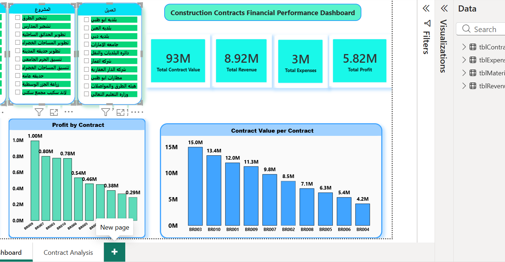
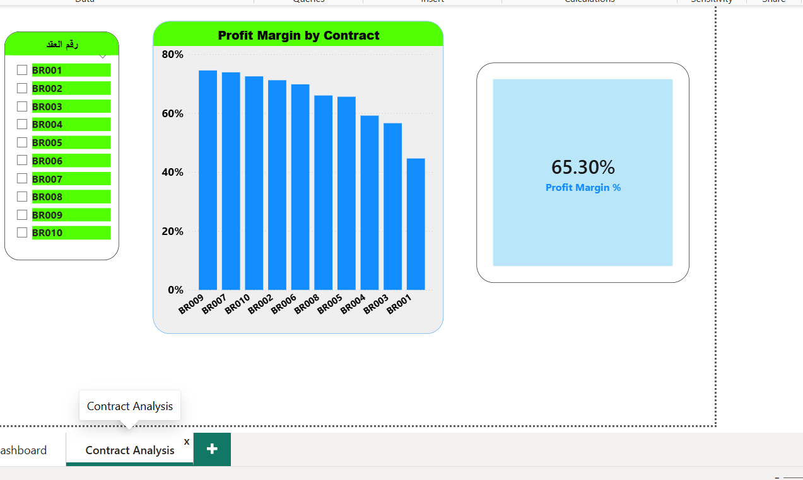

# Construction Contracts Financial Performance Dashboard

## 📌 Project Overview
An interactive Power BI dashboard designed to analyze the financial performance of construction contracts. The dashboard provides insights into contract value, revenue, expenses, profit, and profit margin to support better business decision-making.

## 🛠️ Tools Used
- Microsoft Power BI
- Microsoft Excel
- Power Query
- DAX

## 📊 Dashboard Features
- Financial Performance Analysis
- Contract Profitability Analysis
- Profit Margin Analysis
- Revenue vs. Expenses Analysis
- Interactive Filters (Slicers)
- KPI Cards

## 📷 Dashboard Preview

### Financial Performance Dashboard
📂 [Download the Power BI file](Construction_Contracts_Financial_Performance_Dashboard.pbix) to view the full interactive dashboard.

### Contract Analysis Dashboard

### Profit Margin Analysis

## 👨‍💻 Author
**Mohamed Rabie**
